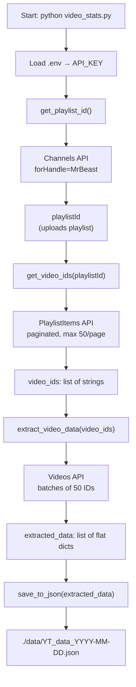
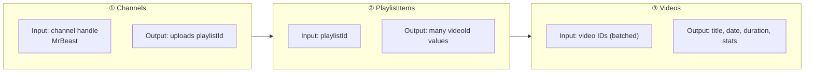
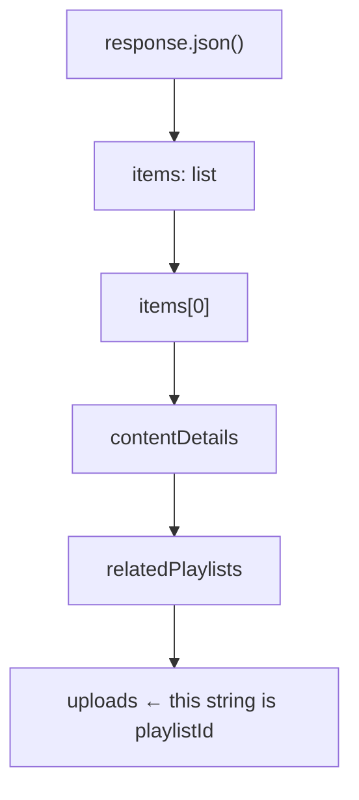
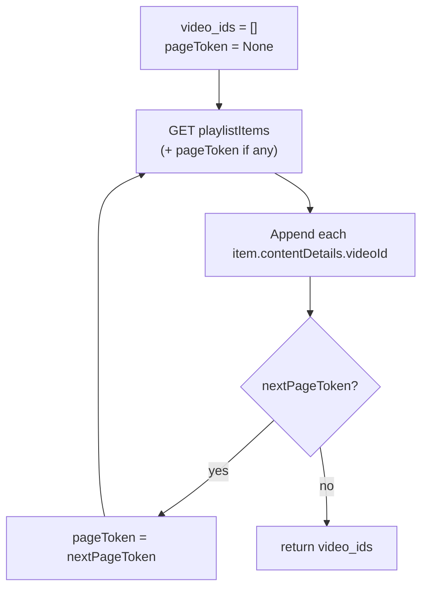
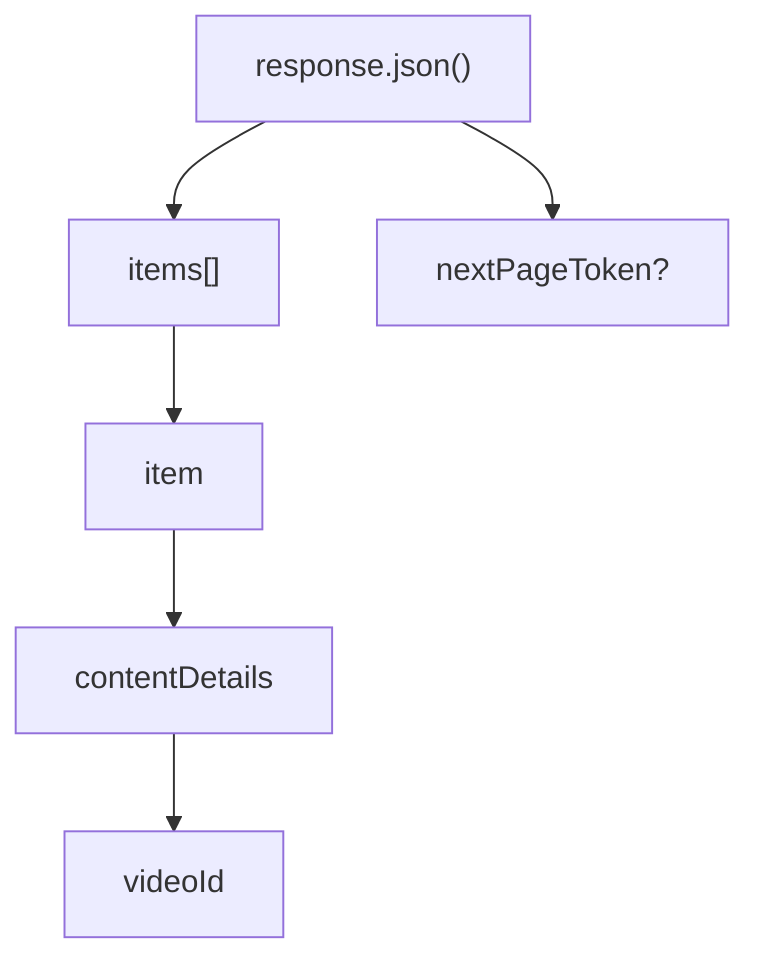
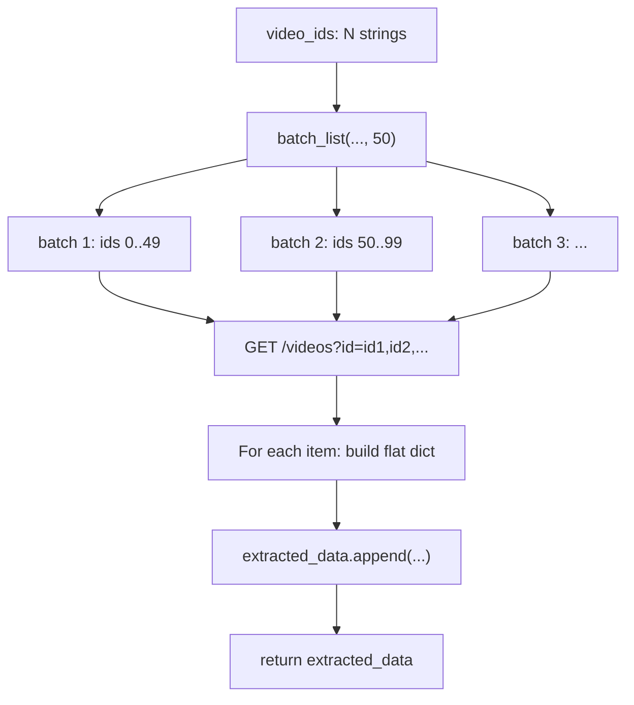
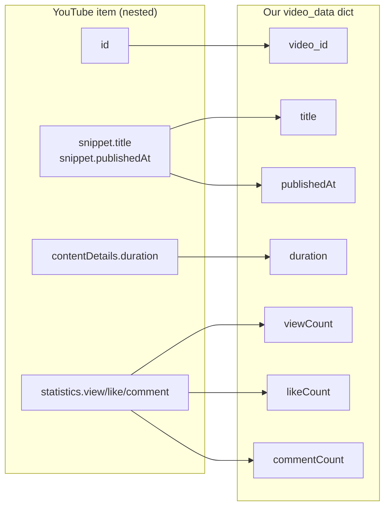
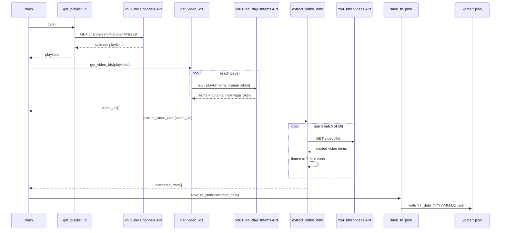
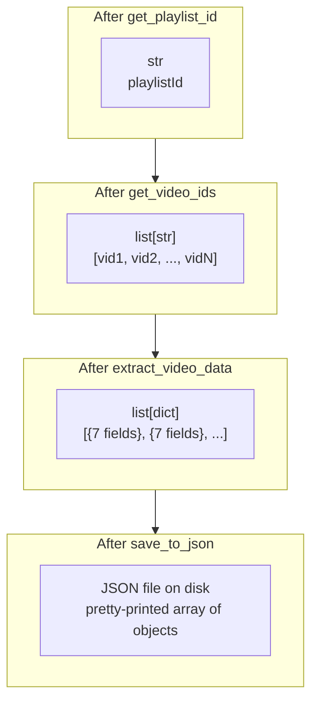

# `video_stats.py` — Complete Walkthrough

This script is the **Extract** step of the ELT pipeline. It talks to the YouTube Data API v3, walks the "Russian doll" chain of endpoints, flattens nested API responses into clean records, and writes them to a dated JSON file under `./data/`.

---

## What problem does this script solve?

YouTube does **not** give you all video stats for a channel in one call. You must:

1. Find the channel’s **uploads playlist**
2. Page through that playlist to collect every **video ID**
3. Batch-request full **video metadata + statistics**
4. Save the result as flat JSON for later loading into a database

That nested chain is the **Russian doll analogy**.

---

## High-level data flow



---

## Imports and configuration (lines 1–12)

| Line / block | What it does |
|---|---|
| `requests` | HTTP client for YouTube API GET calls |
| `json` | Serialize Python objects to a JSON file |
| `date` | Build today’s filename (`YT_data_2026-08-02.json`) |
| `os` + `dotenv` | Read secrets from `.env` instead of hardcoding them |
| `load_dotenv(...)` | Loads `API_KEY=...` from `./.env` into environment variables |
| `API_KEY = os.getenv("API_KEY")` | Reads the key into a Python variable |
| `CHANNEL_HANDLE = "MrBeast"` | Channel to extract (handle, not channel ID) |
| `maxResults = 50` | YouTube’s max page/batch size for these endpoints |

**Why `.env`?** So the API key stays out of source code. Keep `.env` out of git.

---

## Russian doll: how the three APIs nest



You cannot jump straight to rich stats for a whole channel. Each layer unlocks the next.

---

## Function 1 — `get_playlist_id()`

**Purpose:** Open the outer doll. Turn `@MrBeast` into the **uploads playlist ID**.

### Request

```
GET /youtube/v3/channels
  ?part=contentDetails
  &forHandle=MrBeast
  &key=API_KEY
```

- `part=contentDetails` asks for content-related fields (including related playlists).
- `forHandle` looks up the channel by public handle.

### Response shape (simplified)



### What each instruction does

| Code | Meaning |
|---|---|
| Build `url` | Channels endpoint with handle + API key |
| `requests.get(url)` | Call the API |
| `raise_for_status()` | Raise an error if HTTP status is 4xx/5xx |
| `response.json()` | Parse JSON body into a Python `dict` |
| `data["items"][0]` | First (and only) channel object returned |
| `...["relatedPlaylists"]["uploads"]` | Dig into nested keys to get the uploads playlist ID |
| `return channel_playlistId` | Pass that ID to the next function |
| `except RequestException` | Network/HTTP errors bubble up |

**Output type:** `str` — e.g. something like `UUX6OQ3DkcsbYNE6H8uQQuVA` (exact value depends on the channel).

---

## Function 2 — `get_video_ids(playlistId)`

**Purpose:** Open the middle doll. Walk the uploads playlist and collect **every video ID**.

### Why pagination?

A playlist can have hundreds/thousands of videos. YouTube returns at most **50 items per page** (`maxResults=50`). Each page may include `nextPageToken`. As long as that token exists, there is another page.



### Request

```
GET /youtube/v3/playlistItems
  ?part=contentDetails
  &maxResults=50
  &playlistId=...
  &key=API_KEY
  [&pageToken=...]   # only after page 1
```

### Response shape (one page, simplified)



### What each instruction does

| Code | Meaning |
|---|---|
| `video_ids = []` | Accumulator for all IDs across pages |
| `pageToken = None` | First request has no token |
| `base_url = ...` | Shared URL without page token |
| `while True:` | Keep requesting until no more pages |
| `if pageToken: url += ...` | Append token for pages 2, 3, … |
| Loop `data.get("items", [])` | Safely iterate items (empty list if missing) |
| `item["contentDetails"]["videoId"]` | Extract ID from nested playlist item |
| `pageToken = data.get("nextPageToken")` | Prepare next page (or `None`) |
| `if not pageToken: break` | Stop when finished |
| `return video_ids` | Flat list of strings |

**Output type:** `list[str]` — e.g. `["f7y2XikE7sY", "lVylRtlPOIE", ...]`  
This is why your JSON file is huge: MrBeast has a very large uploads history, and every ID becomes a full record later.

---

## Function 3 — `extract_video_data(video_ids)`

**Purpose:** Open the inner doll. For each video ID, fetch **snippet + contentDetails + statistics**, then flatten into the 7 fields we care about.

### Why batching?

The Videos endpoint accepts **multiple IDs in one request** (comma-separated), up to 50. Calling once per video would be slow and burn quota. The nested helper `batch_list` slices the full ID list into chunks of 50.



### Nested helper: `batch_list(video_id_lst, batch_size)`

```python
for video_id in range(0, len(video_id_lst), batch_size):
    yield video_id_lst[video_id : video_id + batch_size]
```

- `range(0, N, 50)` → start indexes `0, 50, 100, ...`
- Slice `[i : i+50]` → one batch
- `yield` makes this a **generator** (lazy batches, one at a time)

Note: the loop variable is named `video_id` but it is actually an **index**. Functionally fine; naming is a bit misleading.

### Request

```
GET /youtube/v3/videos
  ?part=contentDetails
  &part=snippet
  &part=statistics
  &id=id1,id2,...,id50
  &key=API_KEY
```

Three `part`s means three nested objects on each video item:

| `part` | Nested object | Fields we take |
|---|---|---|
| `snippet` | `item["snippet"]` | `title`, `publishedAt` |
| `contentDetails` | `item["contentDetails"]` | `duration` |
| `statistics` | `item["statistics"]` | `viewCount`, `likeCount`, `commentCount` |

### Flattening: nested API → flat record



### What each instruction does

| Code | Meaning |
|---|---|
| `extracted_data = []` | Final list of flat video dicts |
| `batch_list(...)` | Yield ID chunks of size 50 |
| `",".join(batch)` | Turn `["a","b"]` into `"a,b"` for the query string |
| Build `url` with 3 `part`s | Ask for metadata + duration + stats |
| `raise_for_status()` | Fail fast on HTTP errors |
| Unpack `snippet` / `contentDetails` / `statistics` | Local variables for cleaner access |
| Build `video_data = {...}` | Flat schema used downstream |
| `.get("viewCount", None)` etc. | Some stats can be missing; use `None` instead of crashing |
| `append` + `return` | Grow and return the full dataset |

**Output type:** `list[dict]` — one dict per video, matching your JSON file.

Example record:

```json
{
    "video_id": "f7y2XikE7sY",
    "title": "Paying For Food With My Car",
    "publishedAt": "2026-07-31T16:00:11Z",
    "duration": "PT50S",
    "viewCount": "14010118",
    "likeCount": "687391",
    "commentCount": "8250"
}
```

**About the size (~8957 lines):** With `indent=4`, each video is roughly ~9 lines. That means on the order of **~1,000 videos**. The file is large because MrBeast’s uploads playlist is large — not because something went wrong.

---

## Function 4 — `save_to_json(extracted_data)`

**Purpose:** Persist the extracted list to disk for later Load/Transform steps.

| Code | Meaning |
|---|---|
| `file_path = f"./data/YT_data_{date.today()}.json"` | Dated filename under `./data/` |
| `open(..., "w", encoding="utf-8")` | Create/overwrite the file as UTF-8 text |
| `json.dump(..., indent=4, ensure_ascii=False)` | Pretty-print JSON; keep non-ASCII titles readable |

**Important:** The `data/` folder must already exist (or you get `FileNotFoundError`). `open()` does not create parent directories.

**Output:** A file like `./data/YT_data_2026-08-02.json`.

---

## Entry point — `if __name__ == "__main__":`

This block runs only when you execute the file directly (`python video_stats.py`), not when another module imports it.



Order of operations:

1. `playlistId = get_playlist_id()`
2. `video_ids = get_video_ids(playlistId)`
3. `video_data = extract_video_data(video_ids)`
4. `save_to_json(video_data)`

Each step’s output is the next step’s input — classic pipeline chaining.

---

## End-to-end data structure evolution



---

## Error handling pattern

All three API functions use the same pattern:

```python
try:
    # request + parse + extract
except requests.exceptions.RequestException as e:
    raise e
```

`RequestException` covers connection failures, timeouts, and HTTP errors raised via `raise_for_status()`. Re-raising keeps the traceback visible when you run the script. There is no retry/backoff yet — fine for a learning project; production pipelines usually add that later.

---

## How this fits the bigger ELT project

| Stage | Role of this script |
|---|---|
| **E**xtract | `video_stats.py` pulls raw-ish flattened YouTube data → JSON |
| **L**oad | Later: insert JSON into Postgres `staging` schema |
| **T**ransform | Later: clean/reshape into `core` schema |

In the full course repo, this logic eventually lives under Airflow DAGs (e.g. `produce_json`), but right now you are building/understanding the extract logic standalone — which is the right order.

---

## Quick mental checklist

1. **Channels** → playlist ID  
2. **PlaylistItems** (paginated) → all video IDs  
3. **Videos** (batched by 50) → nested details  
4. **Flatten** to 7 fields  
5. **Write** `./data/YT_data_<today>.json`

When you are ready, continue with the instructor’s next step and we will go through it the same way.
